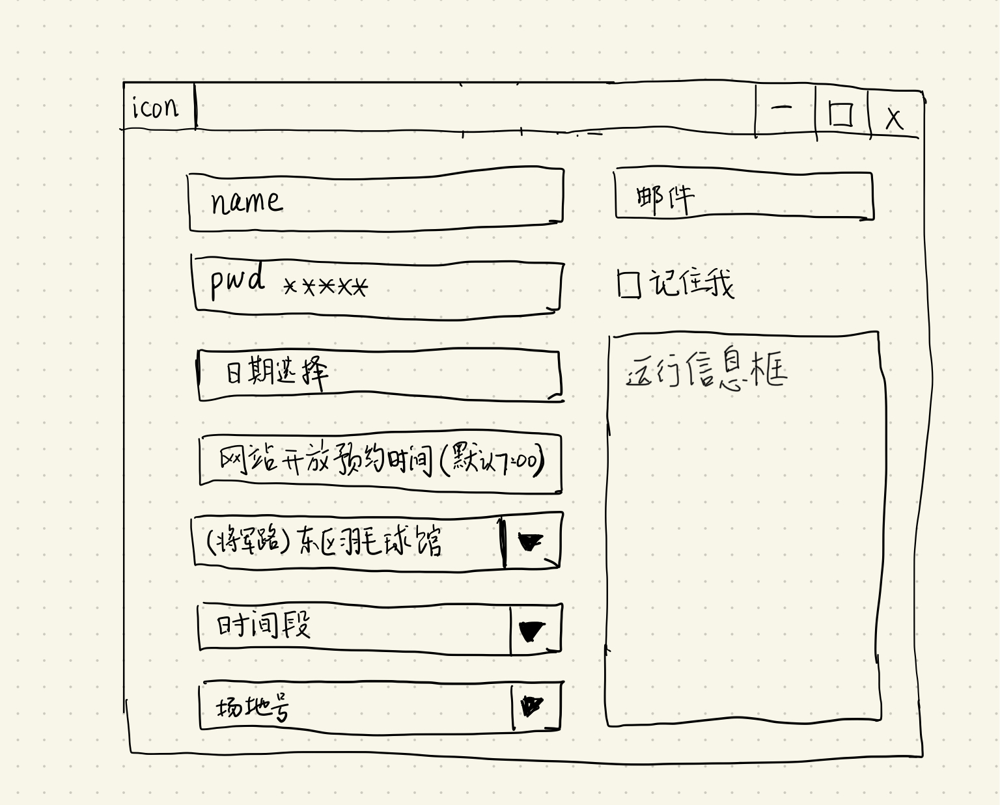

# GUI设计初稿




# 软件操作流程

* 客户端
  * 用户输入姓名和密码

  ​	如果选择了*记住我*，就要把姓名和**加密过的密码**保存在本地。托管任务的时候要一并发送到服务器

  * 选择预约日期和**网站开放预约时间（也就是开抢时间）**（此时其它所有输入框都是 disable 的）
  * 后台执行登录并获取场地信息，先更新并 enable 球馆选择下拉列表
  * 选择场馆，更新并 enable **时间段**和**场地号**下拉列表
  * 选择时间段和场地号
  * 填入接收预约结果的邮箱（可选）
  * 点击确定（图中没有画出来），弹出确认预约的对话框
  * 确认后，把用户信息加密存储到本地，然后上传到服务器，客户端的任务就完成了
  * 结束

* 服务器端
  * 监听用户上传文件事件。如果有新文件上传，读取并简单验证，通过验证后执行服务器端程序，创建定时任务
  * 定点执行 python 预约脚本
  * 执行完毕后删除上传的文件


# 技术要点记录

* python 里面执行shell脚本？
	* 连接服务器
	* 把用户输入信息上传到服务器
	* 在服务器上创建定时任务

​	上面这三个地方都需要执行shell命令。

​	暂时打算使用 `subprocess.call` 模块，使用例子：

```python
subprocess.call('ls -l',shell=True)
# total 1544
# drwxr-xr-x  3 jinmingzhang  staff      96 Jan 11 15:37 GUI界面
# drwxr-xr-x  4 jinmingzhang  staff     128 Jan  9 22:15 __pycache__
# -rw-r--r--  1 jinmingzhang  staff   28845 Jan  8 11:11 getEncPwd.js
# -rw-r--r--  1 jinmingzhang  staff   92329 Jan 11 11:02 halview.html
# -rw-r--r--  1 jinmingzhang  staff   92329 Jan 11 11:02 main_response.html
# -rw-r--r--  1 jinmingzhang  staff    3988 Jan 10 12:52 new_selenium.py
# -rw-r--r--  1 jinmingzhang  staff    8419 Jan 11 11:06 new_yuyue.py
# -rw-r--r--  1 jinmingzhang  staff   29778 Jan 11 11:02 test.html
# -rw-r--r--  1 jinmingzhang  staff    1153 Jan  9 16:43 test_list.py
# -rw-r--r--  1 jinmingzhang  staff    7836 Jan  9 19:35 yuyue.py
# -rw-r--r--  1 jinmingzhang  staff     891 Jan 11 10:49 重新分析.txt
# -rw-r--r--  1 jinmingzhang  staff  499885 Jan  9 18:37 预约关键.json
```


